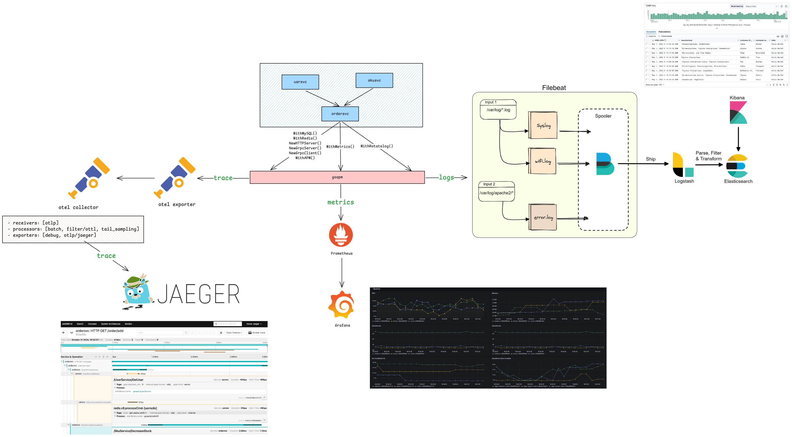

# goapm

[](https://goreportcard.com/report/github.com/hedon954/goapm)
[](https://codecov.io/github/hedon954/goapm)
[](https://github.com/hedon954/goapm/actions)
[](https://github.com/hedon954/goapm/releases)
[](https://pkg.go.dev/github.com/hedon954/goapm)

`goapm` is a toolkit for monitoring and observability of golang applications. It provides a set of libraries that are wrapped around `opentelemetry`.

## Example

- [goapm-example](https://github.com/hedon954/goapm-example)

## Features

- [x] Components support `opentelemetry`
  - [x] sql.DB
  - [x] gorm.DB
  - [x] RedisV6
  - [x] RedisV9
  - [x] HTTP
  - [x] Gin
  - [x] GRPC Server
  - [x] GRPC Client
- [x] Metrics
- [x] AutoPProf
- [x] APM
- [x] RotateLog

## Architecture



## Otel Collector Policy

```yaml
processors:
  batch:
  tail_sampling:
    decision_wait: 5s
    num_traces: 50000
    expected_new_traces_per_sec: 1
    policies:
      [
        {
          name: "pinned-always-sample",
          type: boolean_attribute,
          boolean_attribute: { key: pinned, value: true },
        },
        {
          name: "error-always-sample",
          type: boolean_attribute,
          boolean_attribute: { key: error, value: true },
        },
        {
          name: "slowsql-always-sample",
          type: boolean_attribute,
          boolean_attribute: { key: slowsql, value: true },
        },
        {
          name: "longtx-always-sample",
          type: boolean_attribute,
          boolean_attribute: { key: longtx, value: true },
        },
        {
          name: http-slow,
          type: numeric_attribute,
          numeric_attribute:
            {
              key: http.duration_ms,
              min_value: 1000,
              max_value: 9223372036854775807,
            },
        },
        {
          name: http-status-error,
          type: numeric_attribute,
          numeric_attribute:
            { key: http.status_code, min_value: 500, max_value: 599 },
        },
        {
          name: grpc-slow,
          type: numeric_attribute,
          numeric_attribute:
            {
              key: grpc.duration_ms,
              min_value: 1000,
              max_value: 9223372036854775807,
            },
        },
      ]
  filter/ottl:
    error_mode: ignore
    traces:
      span:
        - 'attributes["drop"] == true'
```
